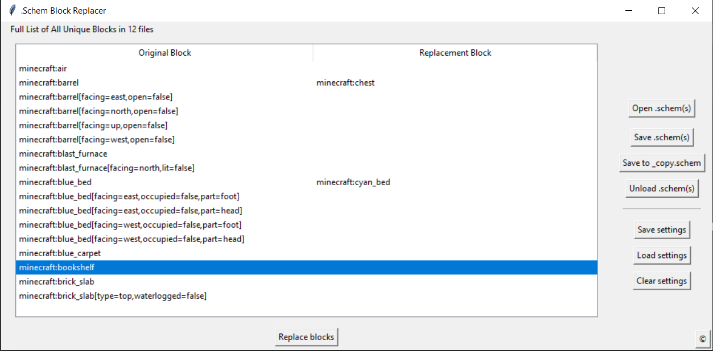
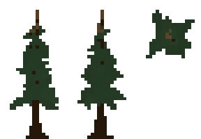
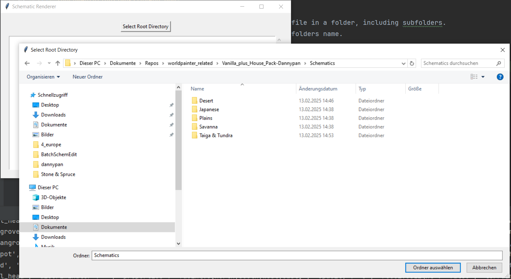
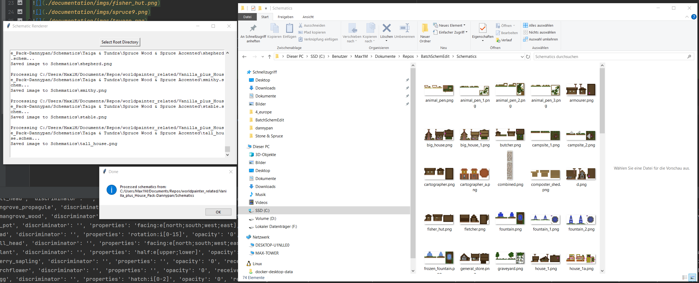
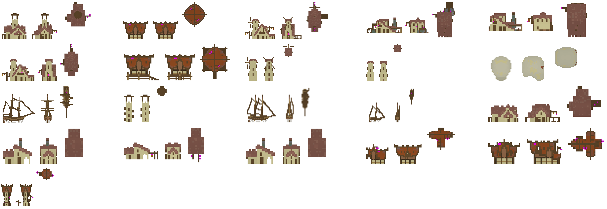

# Batch Schem Edit
With this python program, you can load many .schem files at once, replace block types in all of them and the save back to schem.

## Requirements
python installed on system
python dependecy manager like pip

## Start program
```commandline
pip install -r requirements.txt
python SchemBlockReplacer.py
```

1. load .schem files 
2. select which blocks to replace. empty replacements will be ignored
    - copy paste with ctrl+c ctrl+v
    - save and load settings to/from file to be able to reuse the exact replacements
3. run "replace blocks" to edit loaded schematics
4. save to original or as a copy



Additional:
The list of suggested blocks is updated from the loaded schematics when using "replace" and saved to minecraft_blocks.txt.
Restart program to get updated suggestions.

# Schematic Preview





Schematic Preview will bulk-generate preview images for every .schem file in a folder , including subfolders with a single click.
All images are saved to the scripts directory inside the search folders name. Use it to quickly get a visual overview over a schematics pack.
Run the app:
```commandline
pip install -r requirements.txt
python SchematicPreview.py
```
1. Select a directory to search for schematics:  

2. Renders are saved into the folder name you searched in:  

3. Additionally, a combined.png is generated which combines all schematic renders into on file:


Additional: Unknown blocks use purple color. The block colors are based on worldpainter color information in mc-materials.csv

Notes:
The renders shown in this documentation come from:
1. https://www.planetminecraft.com/project/small-structure-pack/
2. https://www.planetminecraft.com/project/vanilla-house-pack-schematics-axiom-blueprints-and-world-file/
3. https://www.planetminecraft.com/project/oreforge-trees-schems-bundle-350-1-20-4/